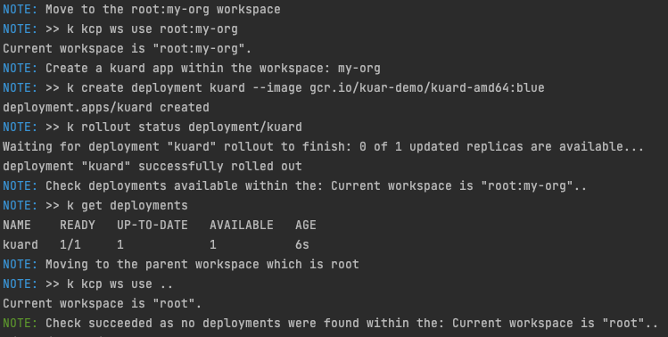

# Introduction

In order to use, play with [kcp](https://github.com/kcp-dev/kcp) it is needed to install different tools: kcp, kubectl kcp plugins and launch it.
Next, you can create workspaces and start to setup logical clusters that kcp will manage on physical clusters.

# Prerequisite

- [kind](https://kind.sigs.k8s.io/docs/user/quick-start/#installation) is installed (if you plan to use a kind k8s cluster)
- A k8s cluster is up and running (e.g `kind create cluster`, ...)
- [kubectx](https://github.com/ahmetb/kubectx)
- [helm installed](https://helm.sh/docs/intro/install/) 

# How to play with kcp

Different commands have been implemented in order to perform using the bash script `./kcp.sh`, the following actions:
```bash
Usage:
  ./kcp.sh <command> [args]

Commands:
    install     Install the kcp server locally and kcp kubectl plugins
    start       Start the kcp server
    stop        Stop the kcp server
    status      Check if KCP is well started
    syncer      Generate and install the syncer component top of a k8s cluster
    clean       Clean up the temp directory and remove the kcp plugins

Arguments:
    -v          Version to be installed of the kcp server. Default: `0.8.2`
    -t          Temporary folder where kcp will be installed. Default: `_tmp`
    -c          Name of the k8s cluster where syncer is installed. Default: `kind`
    -w          Workspace to sync resources between kcp and target cluster. Default: `root:my-org`
    -r          Additional resources to be be sync with the physical cluster.
```
**Remark**: The log of the kcp server started is available at <TEMP_DIR>/kcp-output.log

To setup a demo, then execute by example the following commands :
```bash
kind create cluster
./kcp.sh install -v 0.8.2
./kcp.sh start
```

Next, in a second terminal, you can execute one of the following scenarios described hereafter.

# Scenario

When you plan to use the `end to end` approach and the corresponding `scenario-*.sh` bash script in a terminal, it is possible to specify different parameters.
Use the arg `-h` to get the help: `scenario-*.sh -h`.

# Scenario 1

Objective: 
- Create a kcp workspace, 
- Deploy a Quarkus application, 
- Access the application deployed on the physical cluster (using kubectl proxy)
- Move the workspace one level up (e.g root) and verify that no deployments exist as workspaces are isolated

## Step-by-Step

TODO

## End-to-end script

To execute the scenario end to end, launch in a terminal the following script: `./scenario-1.sh`. If it succeeds, then you will see the following messages:



# Scenario 2

Objective: This scenario is an extension of the previous as we continue to use 1 workspace but where we would like to place the deployment on 2 distinct physical clusters. 
When we will deploy an application, it will be deployed on both clusters as kcp will use the [matching mechanism](https://github.com/kcp-dev/kcp/blob/main/pkg/apis/scheduling/v1alpha1/types_placement.go#L64-L67) to find for a placement,
its location and ultimately the syncTarget related to the [locations](https://github.com/kcp-dev/kcp/blob/main/pkg/apis/scheduling/v1alpha1/types_location.go#L32-L37) and used to sync the resources with the physical clusters.

**Warning**: As the command `kubectl kcp workload sync <cluster_name>` only create 1 `Placement` and 1 `Location` CRDs for the target cluster `<cluster_name>`,
it is then needed to perform some manual steps to create a 2nd placement and Location and to edit the `Synctarget` to use labels able to match the corresponding
resources

Example:

```yaml
apiVersion: scheduling.kcp.dev/v1alpha1
kind: Placement
metadata:
  annotations:
    kcp.dev/cluster: root:my-org
  name: blue
spec:
  locationResource:
    group: workload.kcp.dev
    resource: synctargets
    version: v1alpha1
  locationSelectors:
    - matchLabels:
        color: blue # Location Label to match
 ...       

apiVersion: scheduling.kcp.dev/v1alpha1
kind: Location
metadata:
  annotations:
    kcp.dev/cluster: root:my-org
  labels:
    color: blue
  name: blue
spec:
  instanceSelector:
    matchLabels:
      color: blue # Synctarget label to match
  resource:
    group: workload.kcp.dev
    resource: synctargets
    version: v1alpha1
```
## Step-by-Step
TODO

## End-to-end script

TODO

# Scenario 3

Objective: The purpose of this scenario is to create a workspace, configure kcp to be able to sync additional resources such as: Ingress, Services and finally to deploy a Quarkus application.

## Step-by-Step

TODO

The additional k8s resources are passed to the kcp.sh script using this command:
```bash
./kcp.sh syncer -w my-org -c cluster1 -r ingresses.networking.k8s.io,services
```
If the deployment succeeds, then you will be able to see these messages logged if you execute the end to end scenario `hostname_ip=<IP> ./scenario-3.sh`
```text
NOTE: >> k create deployment quarkus --image=quay.io/rhdevelopers/quarkus-demo:v1
deployment.apps/quarkus created
service/quarkus created
ingress.networking.k8s.io/quarkus created
```
And next, if you have passed to the script the IP address of the VM running the physical cluster, then you should be able to consume the ingress route using the URL
```text
curl http://quarkus.<IP>.sslip.io/
```

## End-to-end script

TODO
